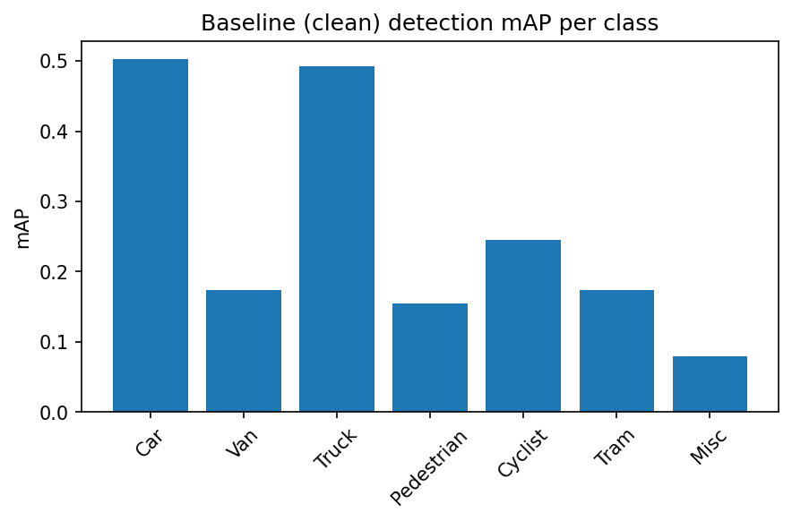

# Image-Processing-Project
Image Processing course final project: evaluating how classical computer-vision methods and a deep-learning model behave under image degradations (noise, blur, compression), and whether restoration or fine-tuning recovers the lost performance.

## Project Decisions

**Dataset: KITTI** — has native ground truth for 2D object detection, semantic segmentation, and optical flow.

**Tasks:**

| # | Task | Level | Method | GT source | Metric |
|---|------|-------|--------|-----------|--------|
| 1 | Feature/keypoint matching | low-level | ORB | none (self-referential correspondence) | match accuracy / repeatability |
| 2 | Optical flow | low-level | classical (Farneback) | KITTI Flow 2015 (native) | EPE |
| 3 | Object detection | high-level, DL | YOLOv8 (head fine-tuned on KITTI's 8 classes) | KITTI 2D Object (native) | mAP / IoU, per class |
| 4 | Semantic segmentation | high-level, DL | SegFormer (Cityscapes-pretrained) | KITTI Semantics, 200 imgs (native) | IoU |

**Distortions and their restoration counterparts:**

| Distortion | Restoration |
|---|---|
| Salt & Pepper noise | Median filter |
| Motion blur | Frequency-domain (Wiener) deconvolution |
| JPEG compression | Bilateral filtering + interpolation |

Full rationale (course-lecture grounding, the COCO→KITTI class-mismatch fix, SegFormer/Cityscapes class-ID alignment check) is documented in `CLAUDE.md`.

## Repository structure

```
src/ipproj/          reusable modules: config, datasets, tasks, distortions, restoration, metrics, viz
notebooks/            orchestration layer, run in order:
  01_dataset_visualization.ipynb
  02_clean_baseline.ipynb
  03_distortions.ipynb
  04_restoration.ipynb
  05_finetuning_distorted.ipynb
```

## Running on Colab

Each notebook's first cell mounts Google Drive and clones/installs this repo, so downloaded KITTI data and trained checkpoints persist across sessions. Run the notebooks in order — later notebooks depend on artifacts (the fine-tuned YOLO checkpoint, results CSVs) saved by earlier ones.

## Figures

Every plot in the notebooks is saved as a PNG under `figures/<notebook>/<name>.png` via `ipproj.viz.plotting.save_figure()`. Unlike `data/`/`checkpoints/` (gitignored, can be large), `figures/` is tracked in git — pull it down from Colab (or a Drive-synced copy) after a run, `git add figures/`, and embed directly in this README, e.g.:

```markdown

```

## Results

_To be filled in as notebooks are run: baseline vs. distorted vs. restored vs. fine-tuned tables and plots, per task and per class._
