# Evaluating Robustness of Classical and Deep-Learning Computer Vision Methods Under Image Degradation

Digital Image Processing — Final Project Technical Report
---

## 📌 1. Project Motivation and Objectives

Computer vision pipelines trained and evaluated on clean, curated imagery routinely degrade when deployed against real-world sensor noise, motion, and compression artifacts.
This project's goal is to:

**1. Quantify Distortion Impact:** Measure how three common, realistic image distortions — impulse (salt & pepper) noise, motion blur, and JPEG compression — degrade the performance of four representative computer-vision tasks spanning classical (non-learned) and deep-learning methods.

**2. Compare Recovery Strategies:** Evaluate two independent restoration workflows:
    * *(a)* Classical, distortion-specific image restoration applied before inference.
    * *(b)* Distortion-aware fine-tuning of the deep-learning models themselves.s.
    
**3. Identify Optimal Strategy:** Determine which recovery strategy is more effective, and whether the answer depends on the task or the distortion.

The project intentionally mixes low-level, non-learned tasks (feature matching, optical flow) with high-level, deep-learning tasks (object detection, semantic segmentation), per the assignment's requirement to cover both levels.

## 📐 2. Problem Definition

The evaluation pipeline follows a fixed five-stage protocol, executed as five sequential notebooks:

| Stage | Notebook | What happens |
|---|---|---|
| Data preparation | `01_dataset_visualization.ipynb` | Download/cache KITTI subsets, split, visualize ground truth |
| Clean baseline | `02_clean_baseline.ipynb` | Fine-tune YOLOv8's head on clean KITTI classes; run all 4 tasks on clean images |
| Robustness testing | `03_distortions.ipynb` | Apply each distortion at 5 severity levels; re-run all 4 tasks; measure degradation |
| Recovery evaluation | `04_restoration.ipynb` | Apply each distortion's restoration counterpart; re-run all 4 tasks; measure recovery |
| Model adaptation | `05_finetuning_distorted.ipynb` | Fine-tune the two DL models (YOLOv8, SegFormer) on a blended mix of all distortions/severities; compare against a same-budget clean-only control |

> ℹ️ Every stage compares against the clean baseline established in notebook 02. Deep learning models complete the full `Clean → Distorted → Restored → Fine-Tuned` pipeline, whereas classical tasks complete `Clean → Distorted → Restored`.

**Dataset:** KITTI

**Tasks:** 
* ORB feature matching
* Farneback optical flow
* YOLOv8 detection
* SegFormer segmentation

## 🚗 3. Dataset

**KITTI** was used because it provides *native* (not derived/proxy) ground truth for three of the four tasks (2D object detection, semantic segmentation, optical flow), and is the dataset named as an example in the course material.

### 3.1 Sources

| Subtask | KITTI archive | Notes |
|---|---|---|
| Object detection | `data_object_image_2.zip` + `data_object_label_2.zip` | Full 2D object benchmark |
| Semantic segmentation | `data_semantics.zip` | KITTI Semantics — 200 labeled images total, this is the *entire* benchmark, not a further-subsampled slice |
| Optical flow | `data_scene_flow.zip` | KITTI Flow 2015 — 200 frame pairs total, likewise the entire benchmark |

Archives are pulled from the `avg-kitti` S3 mirror (`src/ipproj/config.py::KITTI_URLS`).

### 3.2 Subset sizes and splits

Per `config.py`, subset sizes were capped for Colab-friendliness (`OBJECT_DETECTION_SUBSET_SIZE=500`, `SEMANTIC_SEGMENTATION_SUBSET_SIZE=200`, `OPTICAL_FLOW_SUBSET_SIZE=200`), with a deterministic 70/15/15 train/val/test split (`TRAIN_VAL_TEST_SPLIT=(0.7, 0.15, 0.15)`, seeded by `RANDOM_SEED=42`). Actual printed split counts (`notebooks/01_dataset_visualization.ipynb`, cell 13 output):

| Task | Train | Val | Test | Total |
|---|---|---|---|---|
| Object detection | 350 | 75 | 75 | 500 |
| Semantic segmentation | 140 | 30 | 30 | 200 |
| Optical flow | 140 | 30 | 30 | 200 |

### 3.3 Class distribution (object detection)

Instance counts over the 350 training images (`01_dataset_visualization.ipynb`, cell 11 output):

| Class | Count |
|---|---|
| Car | 1,260 |
| Pedestrian | 202 |
| Van | 118 |
| Misc | 57 |
| Truck | 51 |
| Cyclist | 86 |
| Tram | 31 |
| Person_sitting | 19 |

Total: 1,824 labeled objects. **Car dominates at ~69%** of all instances, and `Person_sitting` is the rarest class with only 19 instances — this imbalance recurs throughout the results below (e.g. `Person_sitting` has no ground-truth instances at all in the clean-baseline evaluation split, per notebook 02 cell 13).

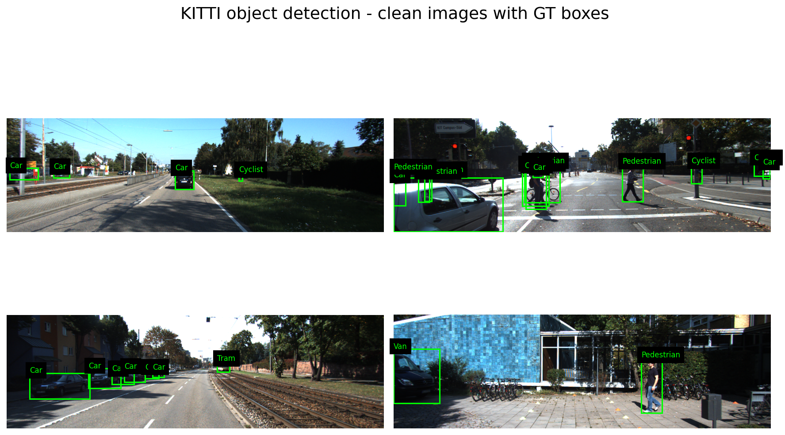
*Sample KITTI images with ground-truth detection boxes (`01_dataset_visualization.ipynb`).*

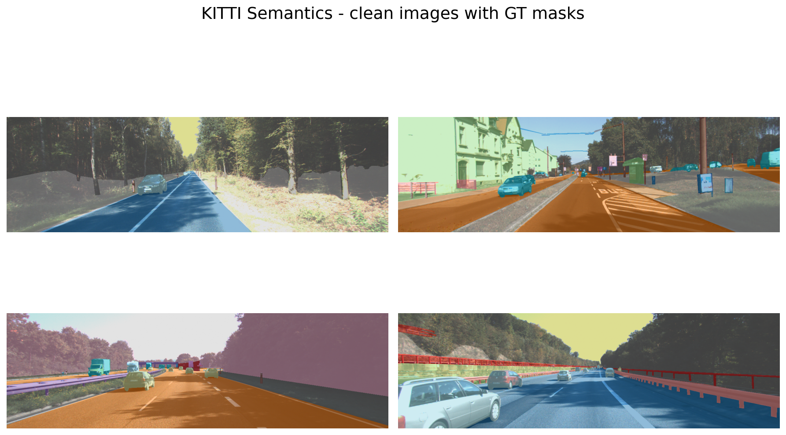
*Sample KITTI Semantics images with ground-truth masks (`01_dataset_visualization.ipynb`).*

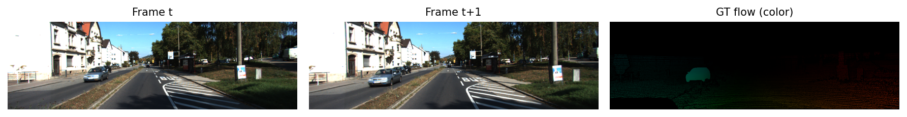
*Sample KITTI Flow 2015 frame pair with ground-truth flow (`01_dataset_visualization.ipynb`).*

### 3.4 Class-mismatch handling (detection)

COCO's 80 pretraining classes do not cover KITTI's own taxonomy (`Pedestrian`, `Cyclist`, `Van`, `Tram` have no COCO equivalent), so YOLOv8's head is fine-tuned on KITTI's own 8 classes (`Car, Van, Truck, Pedestrian, Person_sitting, Cyclist, Tram, Misc`) before any "baseline" evaluation — `DontCare` is excluded from training and kept as an evaluation ignore-region (see §8.2). This fine-tuned checkpoint, not raw COCO-YOLO, is what "baseline"/"clean" means for detection throughout the rest of this report. SegFormer needs no equivalent step: KITTI Semantics natively shares Cityscapes' 19-class taxonomy, verified in code rather than assumed (§8.3).

### 3.5 Data availability caveat

The raw KITTI archives and trained model checkpoints are **not present in the local git clone inspected for this report** — `data/` and `checkpoints/` are both gitignored, and the actual downloads/weights live on the project owner's Google Drive, populated by running the notebooks on Google Colab (see `README.md`, "Running on Colab" / "Running locally"). All results in this report come from the notebooks' own saved execution outputs (committed CSVs and PNGs), not from a local re-run.

## 4. Tasks and Methods

Four tasks, mixing low-level and high-level per the assignment's "at least 3 tasks, include low-level and high-level" requirement.

### 4.1 Feature / keypoint matching — ORB (low-level, classical)

Implementation: `src/ipproj/tasks/feature_matching.py`. ORB keypoints (`cv2.ORB_create(nfeatures=1000)`) are detected and described on both a clean image and its distorted/restored counterpart, then matched with a brute-force Hamming matcher (`cv2.BFMatcher(cv2.NORM_HAMMING)`) using **Lowe's ratio test** (`knnMatch(k=2)`, keep pairs where `m.distance < 0.75 * n.distance`).

Course grounding note (from the module's own docstring): the cited lecture (`F_Features4ML/3060,3061`) only describes "compute descriptor similarity, keep highest similarity matches," and the closest lecture naming a concrete ORB matching algorithm (a different course module, `3803_CV_ImageRegistration`) describes brute-force greedy Hamming matching, not Lowe's ratio test. Using the ratio test here is an explicit, user-approved deviation from the literal lecture content.

Because all three distortions used in this project are purely pixel-domain (no geometric warp), "correctness" of a match does not require a homography — a match is scored correct if the matched keypoint's pixel location in the distorted/restored image is within a small tolerance of its location in the clean image:

**Match accuracy** = (# matches with ‖p_clean − p_other‖₂ ≤ 3.0 px) / (# matches), implemented in `src/ipproj/metrics/match_accuracy.py` (`PIXEL_TOLERANCE = 3.0`).

A secondary diagnostic, `good_match_ratio` (good matches / raw kNN candidate pairs), is also recorded but is a filter-selectivity statistic, not the metric of record.

### 4.2 Optical flow — Farneback (low-level, classical)

Implementation: `src/ipproj/tasks/optical_flow.py`, course-grounded in `B_OpticalFlow/3821_OpticalFlow`. Dense optical flow is computed with `cv2.calcOpticalFlowFarneback` between consecutive KITTI Flow 2015 frame pairs, with parameters `pyr_scale=0.5, levels=3, winsize=15, iterations=3, poly_n=5, poly_sigma=1.2` (`config.FARNEBACK_PARAMS`).

Ground truth: KITTI Flow 2015 (native).

**Metrics** (`src/ipproj/metrics/epe.py`), both standard KITTI Flow 2015 metrics:

- **End-Point Error (EPE)**: the mean Euclidean distance between predicted and ground-truth flow vectors over valid GT pixels:
  `EPE = mean_{(x,y) ∈ valid} ‖(u_pred, v_pred) − (u_gt, v_gt)‖₂`
- **Fl-error** (KITTI's own "Fl-all" outlier criterion): fraction of valid pixels whose EPE exceeds *both* an absolute pixel threshold (3.0 px, `config.FL_ERROR_PIXEL_THRESHOLD`) *and* a relative threshold (5% of the GT flow magnitude, `config.FL_ERROR_RELATIVE_THRESHOLD`).

### 4.3 Object detection — YOLOv8 (high-level, deep learning)

Implementation: `src/ipproj/tasks/object_detection.py`. `yolov8n.pt` (COCO-pretrained backbone) has its head fine-tuned on KITTI's 8 classes (§3.4), for `YOLO_FINE_TUNE_EPOCHS=50` epochs (`config.py`), before any evaluation. `object_detection.fine_tune()` is resumable/idempotent — it detects and continues from an already-finished or partially-finished run rather than always retraining from scratch (relevant given the Colab-session-loss risk described in `README.md`).

**Metrics**: mAP / mAP@0.5 / mAP@0.75 / mAR@100, computed via `torchmetrics.detection.mean_ap.MeanAveragePrecision` (`src/ipproj/metrics/detection_map.py`) rather than a hand-rolled implementation — an explicit choice grounded in the assignment PDF's own advice to "not write/generate long code, use AI and libraries." Per-class AP is read from `map_per_class`; classes with pycocotools' "no valid ground truth for this category" sentinel (`-1`) are dropped rather than reported as a fake negative score.

**DontCare ignore-region handling**: predictions overlapping a KITTI `DontCare` box by IoU ≥ 0.5 (`config.KITTI_IGNORE_IOU_THRESHOLD`) are suppressed from scoring entirely (`suppress_dontcare_predictions()`), matching KITTI's own evaluation protocol — such predictions are neither true positives nor false positives.

### 4.4 Semantic segmentation — SegFormer (high-level, deep learning)

Implementation: `src/ipproj/tasks/semantic_segmentation.py`. `nvidia/segformer-b0-finetuned-cityscapes-1024-1024` (Cityscapes-pretrained) is used off-the-shelf as the clean baseline (no head adaptation needed — see §3.4), then further fine-tuned in notebook 05.

**Class-ID alignment**: rather than assuming the checkpoint's class order matches Cityscapes' canonical 19-class "trainId" taxonomy, `verify_class_alignment()` checks this explicitly at runtime; notebook 02 cell 7 output confirms `True`. KITTI Semantics' raw masks store Cityscapes' 34-class label IDs, not the 19-class trainId taxonomy — `datasets/kitti.py`'s mask reader remaps `id → trainId` (with `255` = void/ignore) before any mask reaches the model or metric, using a table cross-checked against the official `cityscapesscripts` package.

**Metric**: per-class and mean IoU via `torchmetrics.classification.MulticlassJaccardIndex` (`src/ipproj/metrics/segmentation_iou.py`), `average=None` (per-class), with `ignore_index=255`.

### 4.5 Signal-to-noise ratio (cross-task distortion-intensity axis)

To place all three distortions on one common intensity axis (satisfying the requirement to "measure performance per SNR, range of distortion intensities"), `src/ipproj/metrics/snr.py` computes, per image pair:

`SNR(dB) = 10 · log10( mean(clean²) / mean((clean − distorted)²) )`

(with degenerate cases: SNR = +∞ if the images are pixel-identical, 0 if the clean image is a black frame).

## 5. Distortions

Three distortions, each swept across 5 severity levels (`config.py`), each with a course-grounded restoration counterpart (§6). Parameters are centralized in `config.py`, not hardcoded per-call, per the repository's "no magic numbers" convention.

| Distortion | Mechanism | Severity levels (level 1→5) | Course grounding |
|---|---|---|---|
| Salt & pepper noise | Random fraction of pixels set to 0 (pepper) or 255 (salt); `rng.random()` mask vs. `amount/2` / `amount` thresholds (`distortions/salt_pepper.py`) | fraction replaced: `[0.01, 0.03, 0.05, 0.10, 0.20]` | `3046_IP_NoiseSmoothing` |
| Motion blur | Convolution with a normalized linear kernel of given length/angle (`cv2.filter2D`), simulating direction-of-motion smearing (`distortions/motion_blur.py`) | kernel length (px): `[5, 9, 15, 21, 31]` | `3043_IP_Freq_Filtering`, "Enhancing Motion Blur" section |
| JPEG compression | Re-encode/decode through `cv2.imencode(".jpg", ...)` at a given quality | JPEG quality: `[80, 60, 40, 20, 10]` | No dedicated course lecture — grounded only in the assignment PDF's own worked example (explicit, user-approved gap; see `distortions/jpeg_compression.py` docstring) |

All distortions are deterministic given `RANDOM_SEED=42` (salt & pepper draws from a seeded `np.random.default_rng`).

## 6. Restoration Methods

Each distortion is paired with exactly one restoration method, chosen for its course-lecture grounding (or, for JPEG, flagged as ungrounded) rather than for empirically picking the "best" filter — per the project's locked design.

| Distortion | Restoration | Mechanism | Parameters | Grounding |
|---|---|---|---|---|
| Salt & pepper | Median filter | `cv2.medianBlur` | kernel size 5 (`MEDIAN_FILTER_KERNEL_SIZE`) | `3046_IP_NoiseSmoothing` — explicitly states Non-Local Means is "not suitable for impulse noise"; median filtering is the correct counterpart |
| Motion blur | Frequency-domain (Wiener) deconvolution | Per-channel FFT, `W(f) = conj(K(f)) / (|K(f)|² + NSR)`, apply to the channel spectrum, inverse FFT, clip to `[0, 255]` (`restoration/deconvolution.py::_wiener_deconvolve_channel`) | noise-to-signal estimate `NSR = 0.01` (`DECONVOLUTION_SNR_ESTIMATE`); requires the *same* kernel size that produced the distortion (known-kernel assumption) | `3043_IP_Freq_Filtering`, "Enhancing Motion Blur": known degradation kernel → frequency-domain deconvolution |
| JPEG compression | Bilateral filtering + interpolation | 2× cubic upsample (`cv2.INTER_CUBIC`) → bilateral filter → area-interpolation downsample back to original size (`restoration/bilateral_interp.py`) | bilateral `d=9, sigmaColor=75, sigmaSpace=75`; upsample scale 2 | No dedicated lecture — grounded only in the assignment PDF's own worked example; explicitly flagged in the module docstring as the weakest-grounded restoration/distortion pairing in the project |

Note on the Wiener deconvolution's asymmetric signature (it takes `kernel_size` as an explicit argument, unlike the other two restoration functions): this is intentional, per the module's own docstring — deconvolution is only well-posed when the blur kernel is known, and forcing a uniform function signature across all three restoration modules would hide that assumption rather than surface it.

## 7. Experimental Setup

### 7.1 Software / hardware

- **Execution environment**: Google Colab (primary), with a documented local fallback (`config.py` auto-detects Colab via `import google.colab` and switches storage roots accordingly; `README.md`, "Running locally"). Colab provides the GPU used for YOLO/SegFormer training and inference.
- **Key libraries** (`requirements.txt`, unpinned): `numpy`, `opencv-python`, `scikit-image`, `matplotlib`, `pandas`, `torch`, `torchvision`, `ultralytics` (YOLOv8), `transformers` (SegFormer), `torchmetrics`, `pycocotools`, `tqdm`, `pyyaml`, `requests`, `jupyter`.
- **Package**: `src/ipproj` installed editable (`pip install -e .`), Python ≥3.10 (`pyproject.toml`).
- **Reproducibility**: a single global seed, `RANDOM_SEED = 42`, used for splits and stochastic distortion generation; no repeated-run/variance study was performed (see §15, Limitations).

### 7.2 Pipeline / notebook execution

All five notebooks (`01`–`05`) show real, committed execution outputs — populated cell execution counts, printed metrics, and saved figures — confirmed by direct inspection and by the git history (`git log`), which records one commit per notebook run (e.g. `bd76f11 "04 ipynb with results"`, `204449f "notebook 05 with results"`). A `colab_sync.py` step at the end of each notebook copies `figures/` and `results/` to Drive and auto-commits/pushes them to GitHub, which is how these artifacts ended up version-controlled.

### 7.3 Fine-tuning configuration (notebook 02 — clean-adapted baseline)

YOLOv8: `yolov8n.pt` → head fine-tuned on the 8 KITTI classes, clean train/val split, 50 epochs (`YOLO_FINE_TUNE_EPOCHS`). This is a one-time step; its output checkpoint is what every later notebook treats as "baseline."

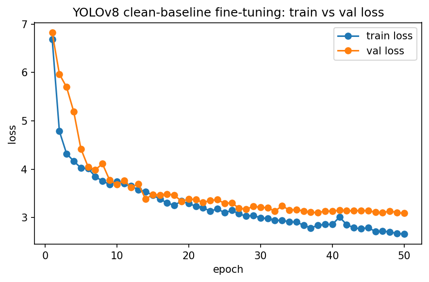
*Train/val loss over 50 epochs, clean-adapted YOLOv8 head fine-tune (`02_clean_baseline.ipynb`).*

### 7.4 Fine-tuning configuration (notebook 05 — distortion-aware adaptation)

Two independently fine-tuned variants per DL model, both continuing from the notebook-02 clean-adapted checkpoint, using the **same** `fine_tune()` function, hyperparameters (`config.YOLO_FINE_TUNE_EPOCHS` / `config.SEGFORMER_FINE_TUNE_EPOCHS=10` @ `lr=5e-5`), and train/val split — the only intentional difference is the training images:

- **Distortion-aware**: fine-tuned on a **blended** training mix — every training/validation image, materialized through *every* distortion type at *every* one of its 5 severity levels (3 distortions × 5 levels = 15 variants per source image, for both the detection and segmentation splits). Built in notebook 05 cell 4.
- **Clean-control**: fine-tuned on the same clean train/val split, same epoch budget, same starting checkpoint — an ablation to isolate whether the benefit comes from *seeing* distorted data, or merely from the extra training budget itself.

Training curves (saved figures, `figures/05_finetuning_distorted/`):

| Model / variant | Train loss trend | Val loss trend | Figure |
|---|---|---|---|
| YOLOv8, distortion-aware | ~3.12 → ~1.66 | plateaus ~2.92–2.95 after epoch 20 | `yolo_training_curve_blended.png` |
| YOLOv8, clean-control | ~2.88 → ~2.33 | flattens ~3.03–3.05 | `yolo_training_curve_clean_control.png` |
| SegFormer, distortion-aware | ~0.27 → ~0.09 | plateau ~0.33–0.35, uptick to ~0.40 at epoch 10; best checkpoint auto-selected epoch 2–7 | `segformer_training_curve_blended.png` |
| SegFormer, clean-control | ~0.44 → ~0.17 | stays lower, ~0.23 | `segformer_training_curve_clean_control.png` |

(Source: notebooks/05's own markdown analysis cells immediately following each training curve.)

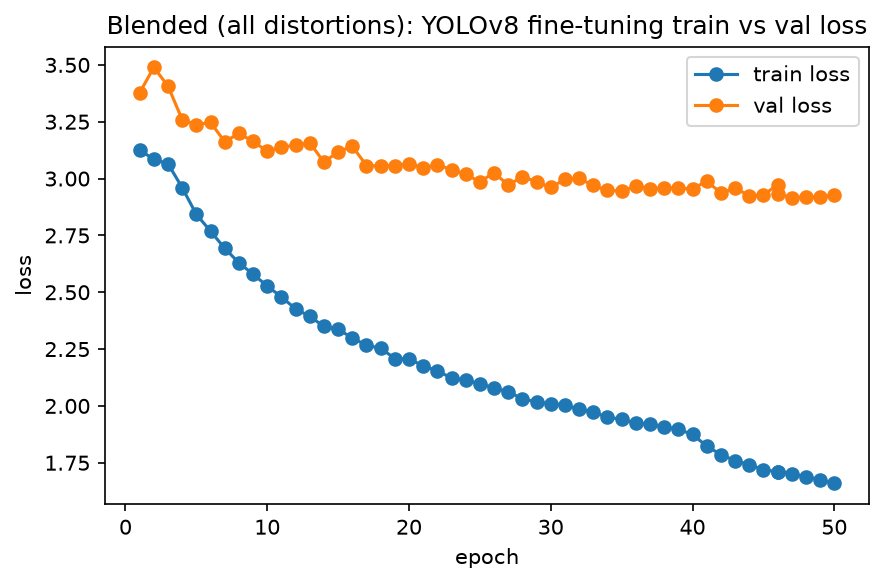
*YOLOv8, distortion-aware (blended) fine-tune — train vs. val loss (`05_finetuning_distorted.ipynb`).*

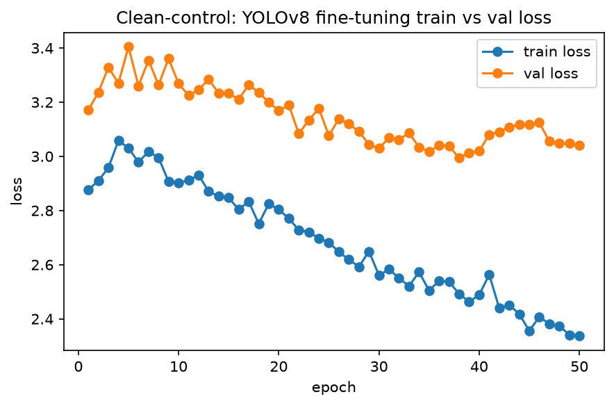
*YOLOv8, clean-control fine-tune — train vs. val loss (`05_finetuning_distorted.ipynb`).*

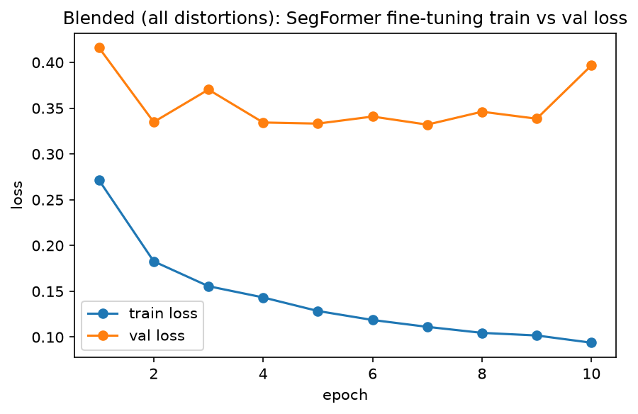
*SegFormer, distortion-aware (blended) fine-tune — train vs. val loss (`05_finetuning_distorted.ipynb`).*

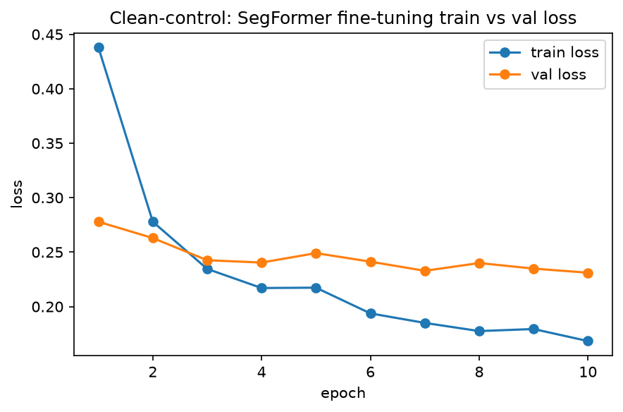
*SegFormer, clean-control fine-tune — train vs. val loss (`05_finetuning_distorted.ipynb`).*

For reference, the original clean-baseline YOLOv8 head fine-tune (notebook 02, curve shown in §7.3 above) showed train/val loss dropping steeply from ~6.7 to ~3.7 within the first 10 epochs, no overfitting through 50 epochs, val loss plateauing ~3.1 after epoch 30.

## 8. Evaluation Methodology

For every task, four (or, for the two classical tasks, three) pipeline stages are compared against the same test-set images: **clean → distorted → restored → (DL tasks only) fine-tuned**. All distortion/restoration sweeps use the *same* test split across notebooks 03/04/05, so results are directly comparable.

### 8.1 Metric summary

| Task | Metric(s) | Direction |
|---|---|---|
| Feature matching | Match accuracy (pixel-tolerance correctness, §4.1) | higher is better |
| Optical flow | EPE (pixels), Fl-error (outlier fraction) | lower is better |
| Object detection | mAP, mAP@0.5, mAP@0.75, mAR@100, per-class AP | higher is better |
| Semantic segmentation | Mean IoU, per-class IoU | higher is better |
| (all tasks, distortion-intensity axis) | SNR (dB) | higher = less distorted |

### 8.2 DontCare / ignore-region protocol

KITTI's `DontCare` label marks ignore-regions, not a real class — it is excluded from YOLO training and handled purely as an evaluation ignore-region (§4.3), matching KITTI's own protocol rather than either training on it or penalizing predictions that land on it.

### 8.3 SegFormer class-alignment verification

Rather than assuming the pretrained Cityscapes checkpoint's class-ID order matches KITTI Semantics' ground truth, this is checked programmatically (`verify_class_alignment()`) before any evaluation trusts it — confirmed `True` in notebook 02.

## 9. Results

### 9.1 Clean baseline (notebook 02)

Source: `results/02_clean_baseline/summary.csv`.

| Task | Metric | Value |
|---|---|---|
| Feature matching | Mean ORB keypoints (clean) | 1000.0 |
| Feature matching | Match accuracy (clean-vs-clean self-match) | 1.000 |
| Optical flow | EPE | 28.648 px |
| Optical flow | Fl-error | 0.558 (55.8% outliers) |
| Object detection | mAP | 0.2601 |
| Object detection | mAP@0.5 | 0.4171 |
| Object detection | mAP@0.75 | 0.2821 |
| Object detection | mAR@100 | 0.3014 |
| Semantic segmentation | Mean IoU | 0.3874 |

Notes:
- The ORB "match accuracy" clean-baseline value (1.000) is a **clean-vs-clean self-match** — a trivial ceiling case, not comparable to the clean-vs-distorted accuracies reported in §9.2 (this is stated explicitly in notebook 03's own markdown, cell 16).
- The EPE baseline (28.648 px) is already large even on clean images — this is the classical Farneback method's inherent accuracy on KITTI Flow 2015, not a distortion artifact; it serves purely as the reference point for §9.2/9.3's comparisons.
- Object detection per-class: highest AP for **Car (0.50)** and **Truck (0.49)**; **Person_sitting** has zero ground-truth instances in this evaluation split and is excluded from its per-class chart.
- Segmentation per-class: highest IoU for **Sky (0.90), Vegetation (0.87), Car (0.85), Building (0.81), Road (0.80)**; lowest for **Person (~0.01), Rider (0.10), Bus/Train/Motorcycle (0.0)** — attributed in the notebook's own analysis to class imbalance or total absence of some categories in this test slice.

*Per-class detection AP on clean images (`02_clean_baseline.ipynb`).*

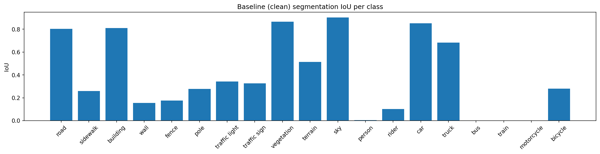
*Per-class segmentation IoU on clean images (`02_clean_baseline.ipynb`).*

**Provenance caveat**: notebook 05 loads its own "clean" reference from a separate, non-git-tracked copy of this table (`data/results/02_clean_baseline.csv`, evidently from a later, unsynced re-run of notebook 02 after a documented GPU fix, commit `3c97cea`). That copy's numbers are close but not byte-identical to the git-tracked ones above (e.g. clean mAP@0.5 reads as 0.419 in notebook 05's tables vs. 0.4171 here) — both are legitimate baseline evaluation runs on the same 500-image split, and the difference is well within normal eval-to-eval variance; §9.4 uses notebook 05's own internal reference for internal consistency with its own comparison table, and this discrepancy is noted rather than silently reconciled.

### 9.2 Robustness under distortion (notebook 03)

Source: `results/03_distortions/summary.csv` (15 rows: 3 distortions × 5 severity levels). Selected rows (level 0 = mildest, level 4 = most severe):

**Salt & pepper noise**

| Level | Amount | SNR (dB, detection) | Match acc. | mAP | Mean IoU |
|---|---|---|---|---|---|
| 0 | 0.01 | 18.10 | 0.987 | 0.206 | 0.367 |
| 2 | 0.05 | 11.18 | 0.965 | 0.068 | 0.265 |
| 4 | 0.20 | 5.12 | 0.889 | 0.0062 | 0.121 |

**Motion blur**

| Level | Kernel (px) | SNR (dB, detection) | Match acc. | mAP | Mean IoU |
|---|---|---|---|---|---|
| 0 | 5 | 21.13 | 0.983 | 0.249 | 0.387 |
| 2 | 15 | 16.09 | 0.696 | 0.095 | 0.340 |
| 4 | 31 | 13.78 | 0.323 | 0.025 | 0.274 |

**JPEG compression**

| Level | Quality | SNR (dB, detection) | Match acc. | mAP | Mean IoU |
|---|---|---|---|---|---|
| 0 | 80 | 22.09 | 0.998 | 0.274 | 0.372 |
| 2 | 40 | 20.91 | 0.997 | 0.278 | 0.359 |
| 4 | 10 | 18.72 | 0.989 | 0.165 | 0.236 |

Full 15-row table with all metrics (EPE, Fl-error, mAP@0.5/0.75, mAR@100) is in the CSV (`results/03_distortions/summary.csv`). Supporting figures:

**Before/after, strongest severity, and the full severity grid:**

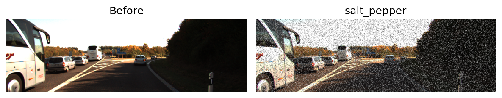
*Sample image before/after salt & pepper noise at its strongest tested level.*

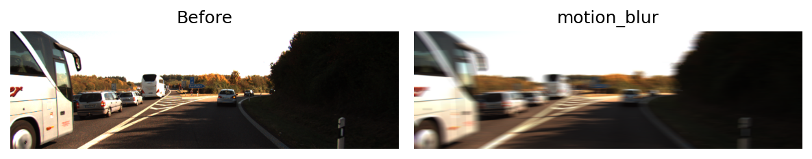
*Sample image before/after motion blur at its strongest tested level.*

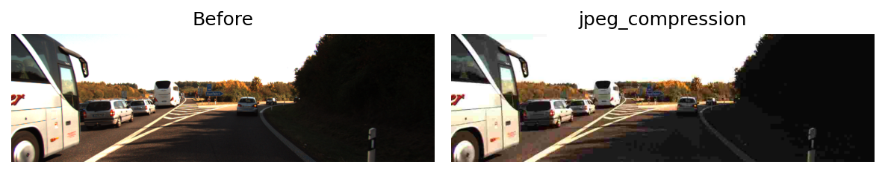
*Sample image before/after JPEG compression at its strongest tested level.*

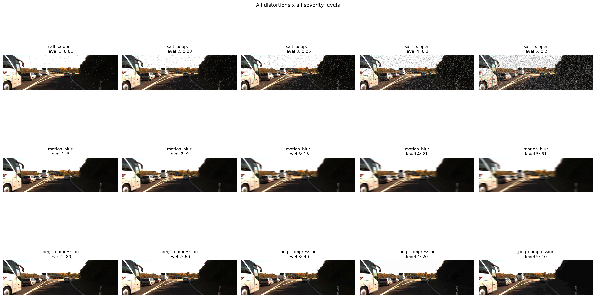
*Every distortion (row) at every configured severity level (column), same sample image.*

**Performance vs. SNR — summary grids (all tasks, all distortions):**

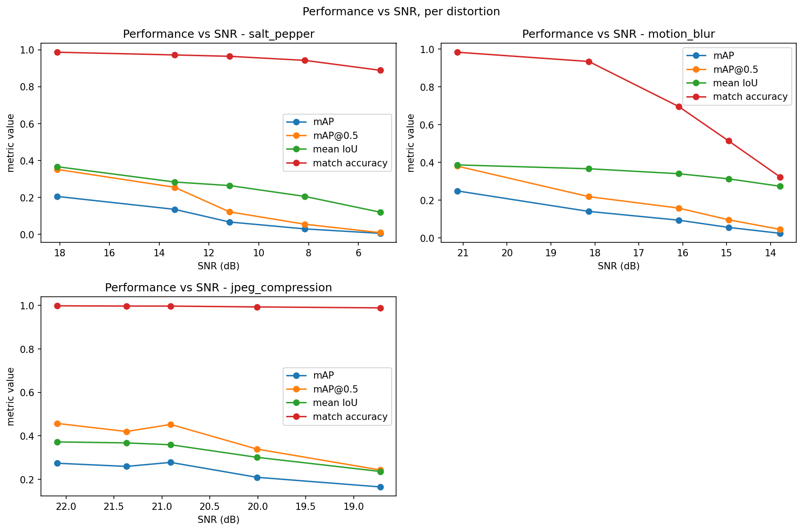
*Match accuracy, EPE/Fl-error, mAP, and mean IoU vs. SNR, one panel per task.*

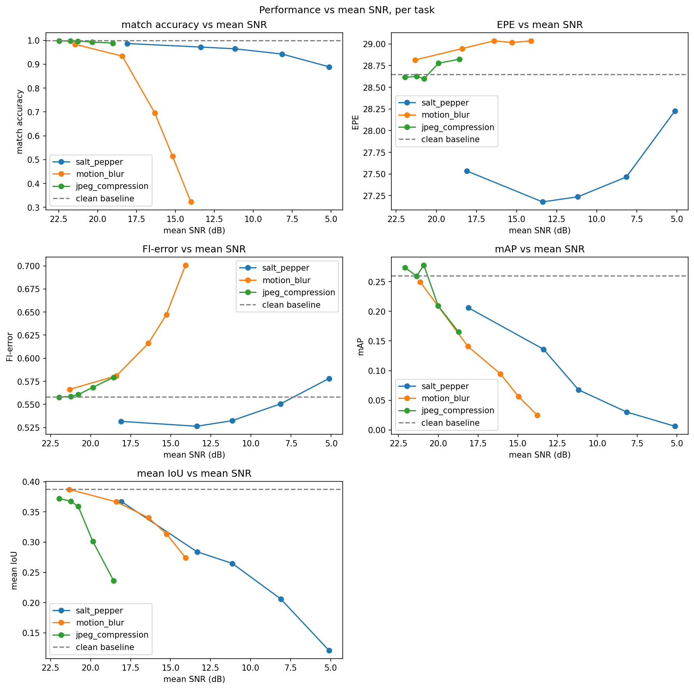
*Same as above, with a horizontal clean-baseline reference line per task.*

**Robustness bar charts (metric vs. distortion severity, clean-baseline reference line):**

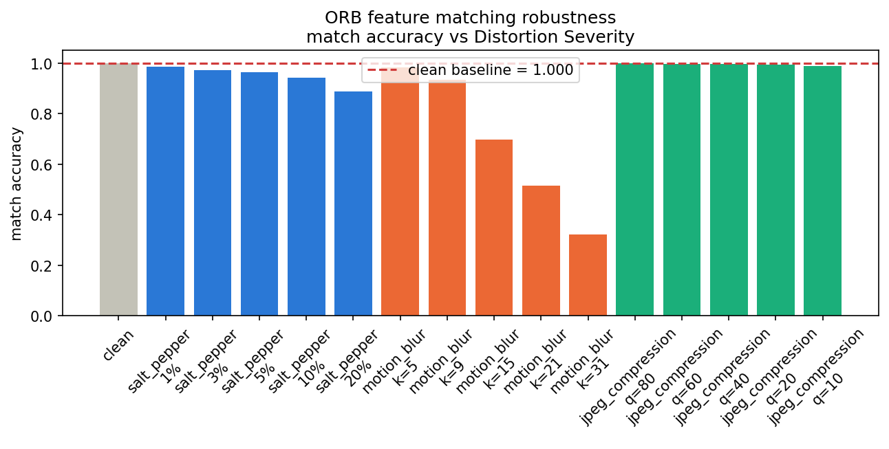
*ORB match accuracy across all distortion×severity conditions.*

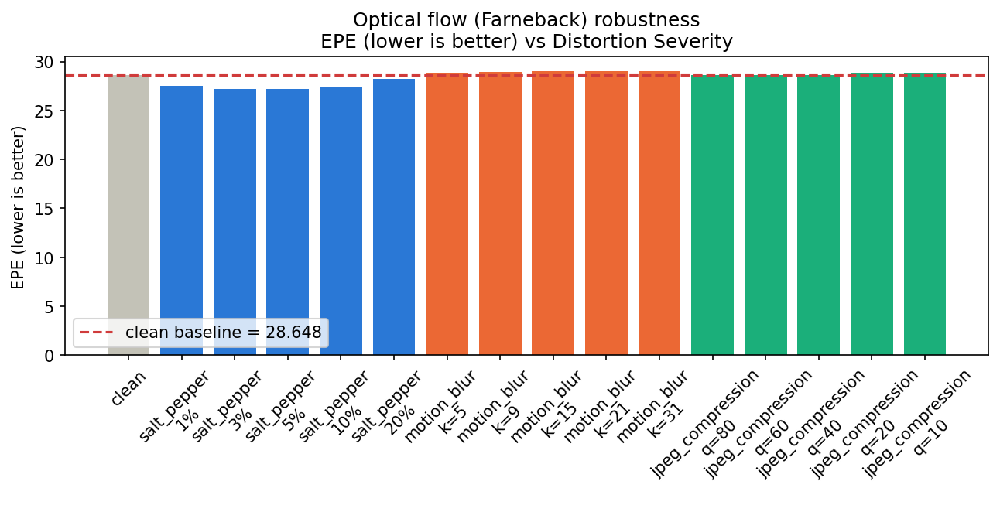
*Optical flow EPE across all distortion×severity conditions (lower is better).*

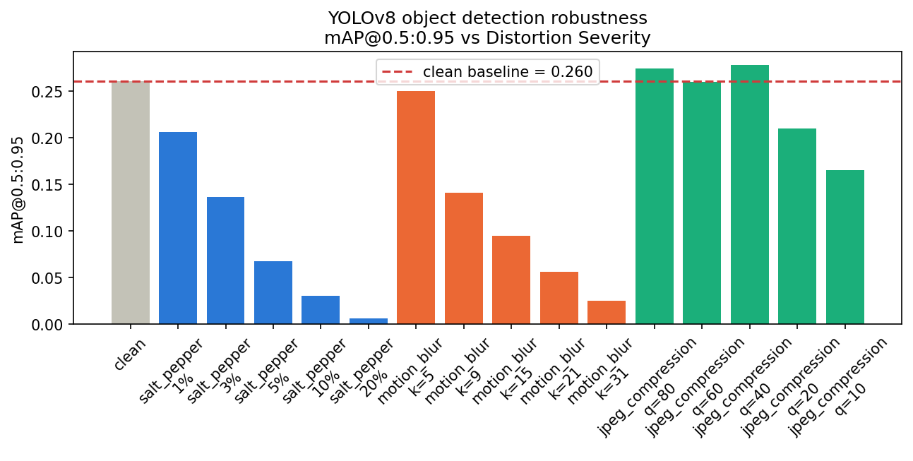
*Detection mAP across all distortion×severity conditions.*

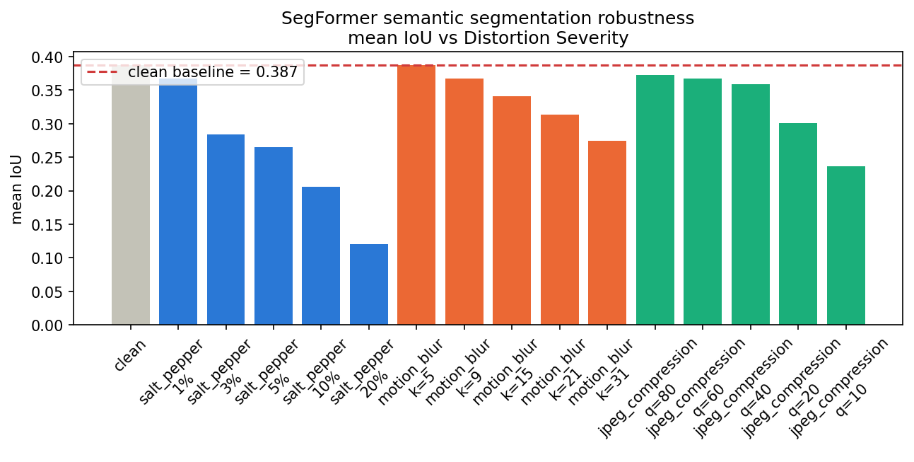
*Segmentation mean IoU across all distortion×severity conditions.*

**Per-task, per-distortion performance vs. SNR (individual curves underlying the summary grids above):**

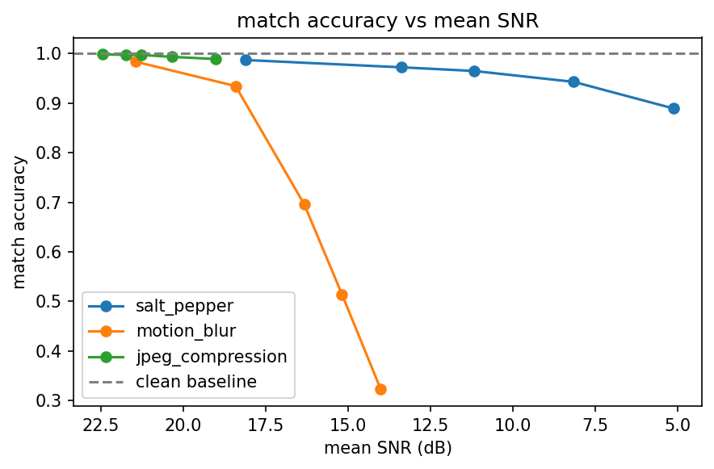
*ORB match accuracy vs. SNR, one curve per distortion.*

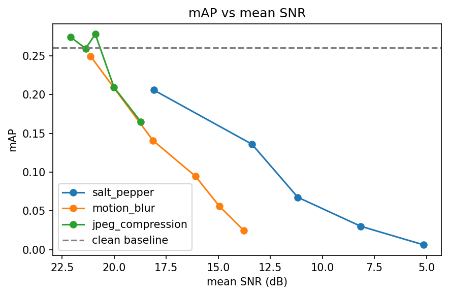
*Detection mAP vs. SNR, one curve per distortion.*

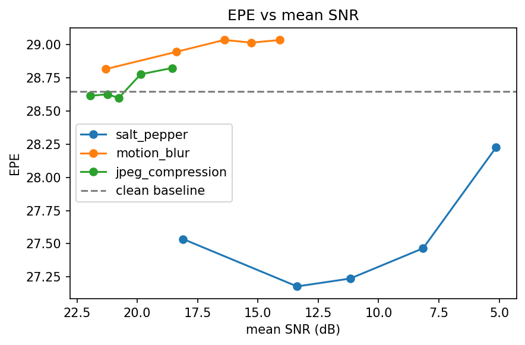
*Optical flow EPE vs. SNR, one curve per distortion.*

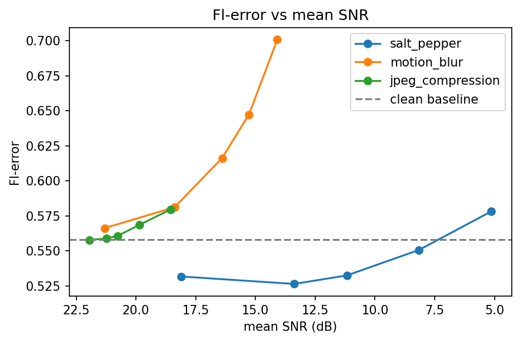
*Optical flow Fl-error vs. SNR, one curve per distortion.*

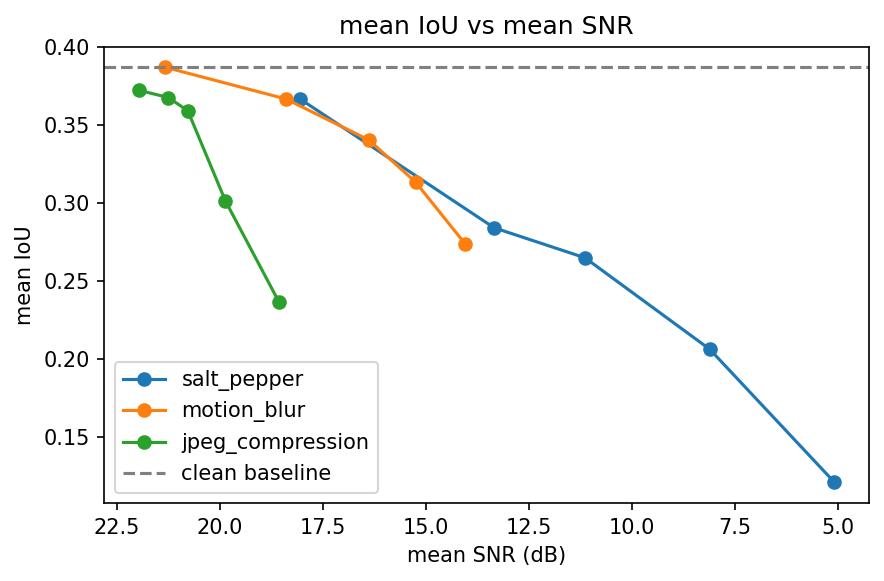
*Segmentation mean IoU vs. SNR, one curve per distortion.*

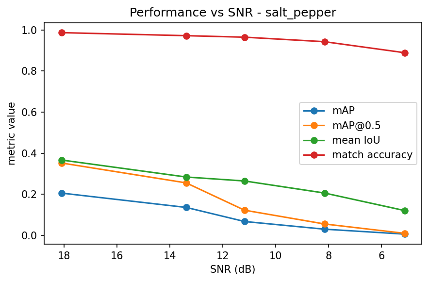
*All-task performance vs. SNR, salt & pepper noise only.*

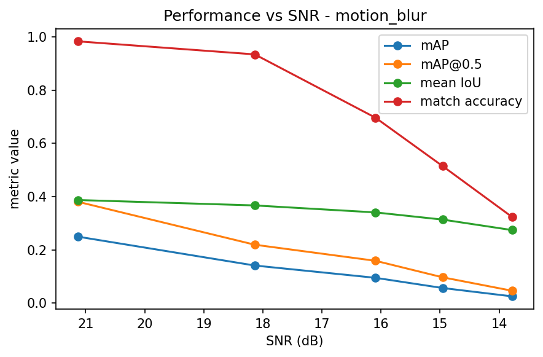
*All-task performance vs. SNR, motion blur only.*

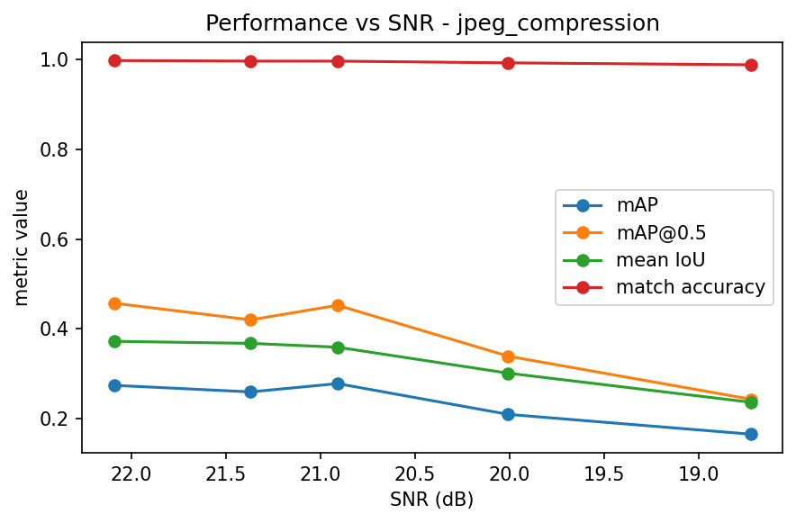
*All-task performance vs. SNR, JPEG compression only.*

**Per-task vulnerability summary** (notebook 03's own analysis tables, cells 18 and 22):

| Vision task | Most damaging distortion | Most tolerated | Key bottleneck |
|---|---|---|---|
| Feature matching (ORB) | Motion blur (k≥15) | Salt & pepper / JPEG | Needs sharp, unblurred high-frequency corners |
| Optical flow (Farneback) | Motion blur | JPEG compression | Severely degrades when texture correspondence is smeared |
| Object detection (YOLOv8) | Salt & pepper and motion blur | JPEG compression (q≥40) | Needs precise local edge/gradient cues to anchor bounding-box proposals; total proposal collapse under severe noise/blur |
| Semantic segmentation (SegFormer) | Salt & pepper (>10%) | Motion blur & mild JPEG | Global-context attention gives structural resilience to blur, but drops under heavy quantization/noise |

A notable secondary finding (notebook 03, cell 18): at mild-to-moderate salt-and-pepper noise (18 dB–13 dB SNR), Farneback optical flow EPE/Fl-error were reported *lower* than the clean baseline before rising again at 5 dB — attributed to impulse noise producing identical, stationary 0/255 pixel spikes across consecutive frames, which the classical flow estimator can interpret as near-zero motion, artificially suppressing the error metric. This is flagged in the source notebook as a metric artifact, not a genuine robustness advantage.

Under the most severe motion blur tested, 6 of 8 detection classes dropped to (near) 0.0 mAP, while segmentation retained substantially more of its performance at the same severity — attributed to YOLO's dependence on sharp local edge gradients for region proposals vs. SegFormer's transformer backbone leveraging global spatial context.

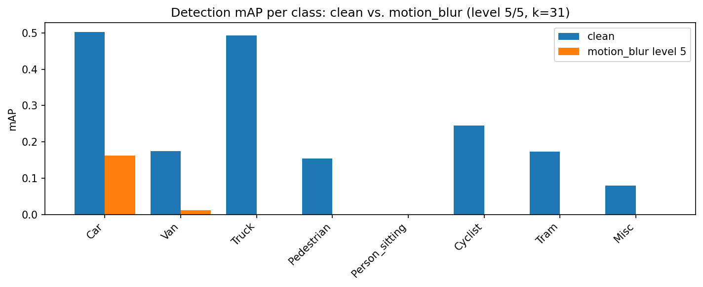
*Per-class detection mAP, clean vs. motion blur at its most severe tested level.*

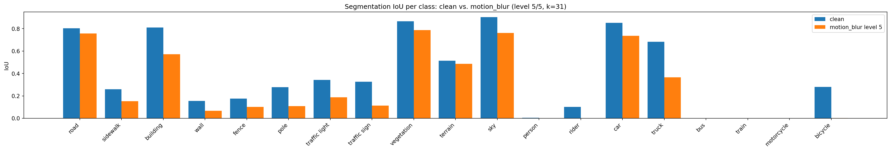
*Per-class segmentation IoU, clean vs. motion blur at its most severe tested level.*

### 9.3 Restoration (notebook 04)

Source: `results/04_restoration/summary.csv` (15 rows, same distortion × level grid as §9.2, now post-restoration). Selected rows at each distortion's most severe tested level (level 4), restored vs. the corresponding distorted value from §9.2:

| Distortion | Metric | Distorted (lvl 4) | Restored (lvl 4) |
|---|---|---|---|
| Salt & pepper | mAP | 0.0062 | 0.2394 |
| Salt & pepper | Mean IoU | 0.121 | 0.3304 |
| Salt & pepper | Match accuracy | 0.889 | 0.960 |
| Motion blur | mAP | 0.0249 | 0.1098 |
| Motion blur | Mean IoU | 0.274 | 0.2735 |
| Motion blur | Match accuracy | 0.323 | 0.856 |
| JPEG compression | mAP | 0.1651 | 0.1672 |
| JPEG compression | Mean IoU | 0.236 | 0.2372 |
| JPEG compression | Match accuracy | 0.989 | 0.989 |

Full table in the CSV (`results/04_restoration/summary.csv`). Supporting figures:

**Before/after restoration, strongest severity:**

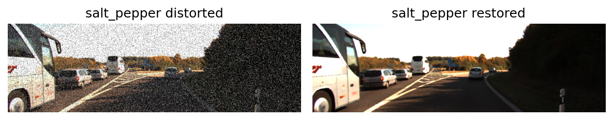
*Distorted vs. restored, salt & pepper noise, strongest tested level.*

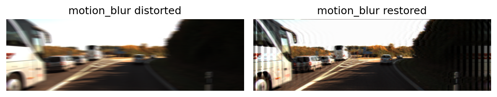
*Distorted vs. restored, motion blur, strongest tested level.*

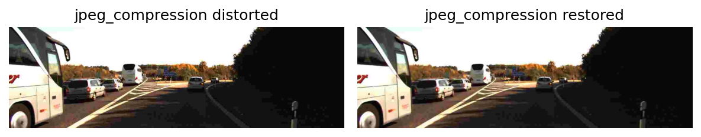
*Distorted vs. restored, JPEG compression, strongest tested level.*

**Clean vs. distorted vs. restored, sample image:**

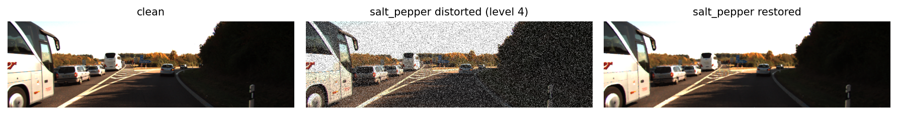
*Sample image across all three pipeline stages, salt & pepper noise.*

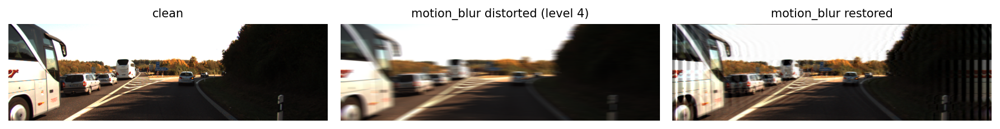
*Sample image across all three pipeline stages, motion blur.*

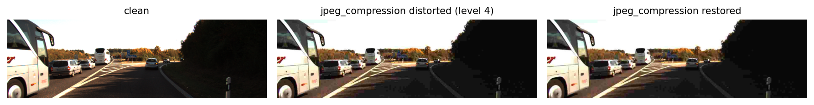
*Sample image across all three pipeline stages, JPEG compression.*

**Per-task comparison across distortions (clean / distorted / restored, strongest severity):**

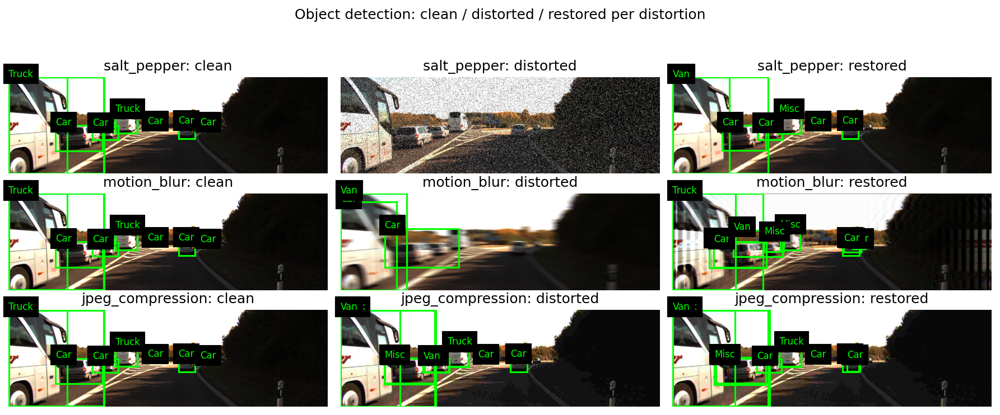
*Detection boxes across all 3 distortions × clean/distorted/restored.*

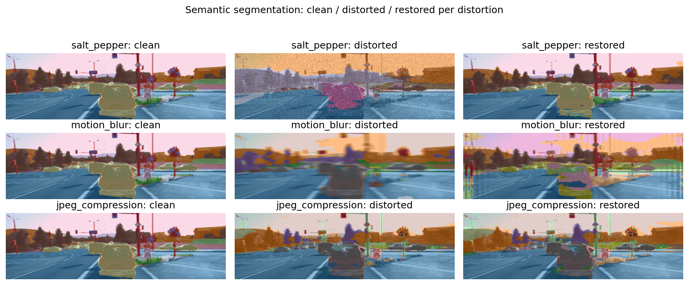
*Segmentation masks across all 3 distortions × clean/distorted/restored.*

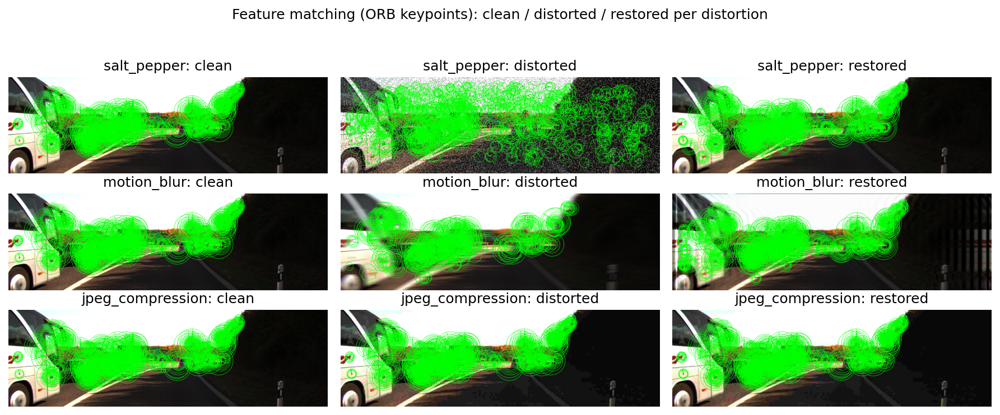
*ORB keypoints across all 3 distortions × clean/distorted/restored.*

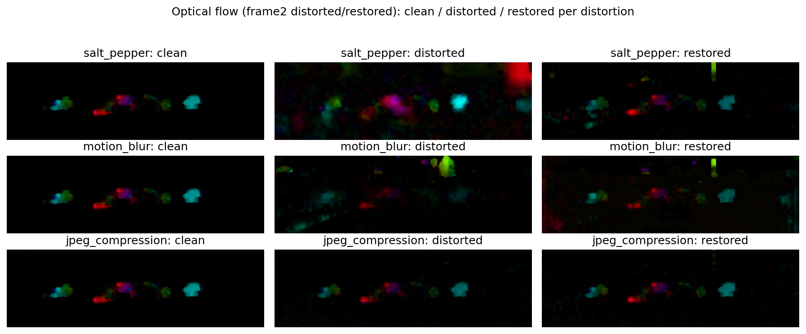
*Flow fields across all 3 distortions × clean/distorted/restored.*

**Per-distortion metrics grids (all tasks, distorted vs. restored):**

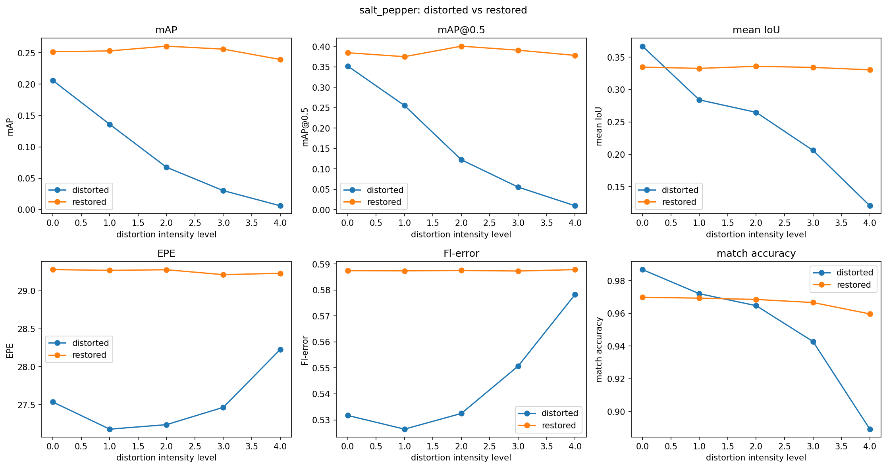
*All-task metrics, distorted vs. restored, salt & pepper noise.*

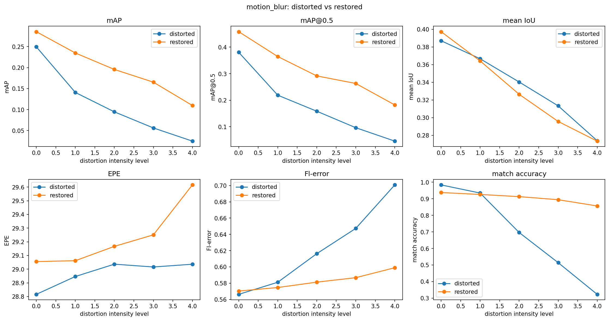
*All-task metrics, distorted vs. restored, motion blur.*

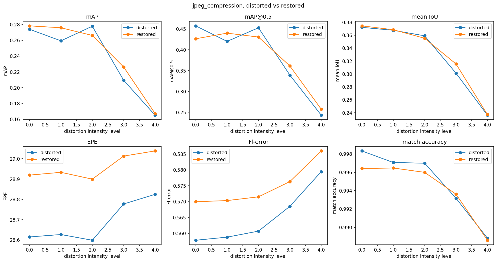
*All-task metrics, distorted vs. restored, JPEG compression.*

**Per-class AP/IoU, distorted vs. restored, strongest severity:**

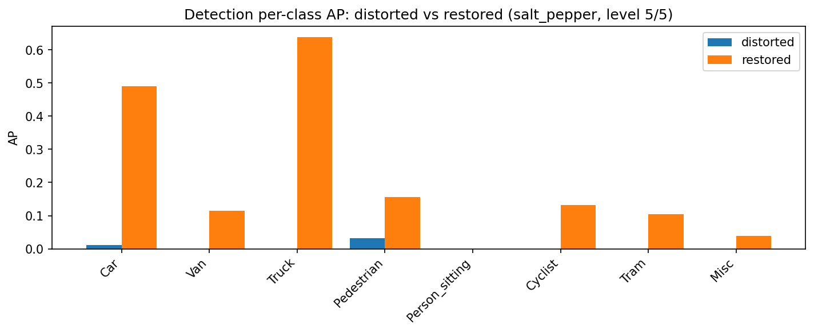
*Per-class detection AP, distorted vs. restored, salt & pepper noise.*

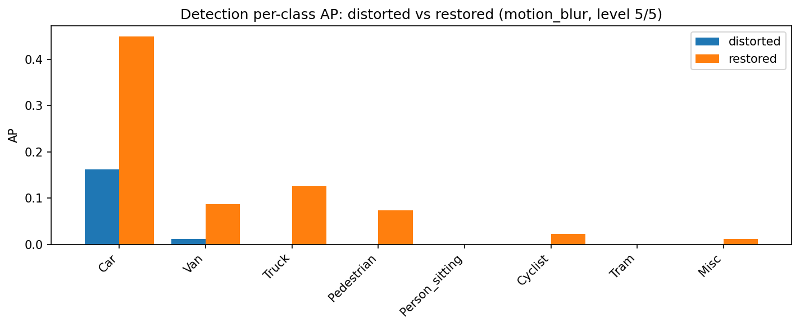
*Per-class detection AP, distorted vs. restored, motion blur.*

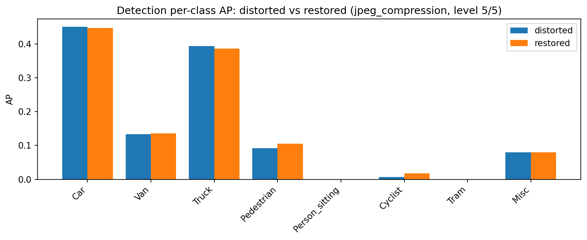
*Per-class detection AP, distorted vs. restored, JPEG compression.*

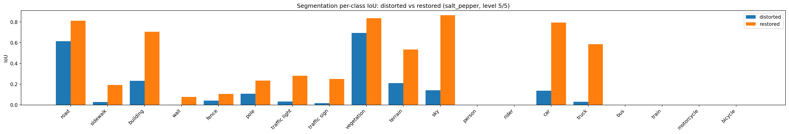
*Per-class segmentation IoU, distorted vs. restored, salt & pepper noise.*

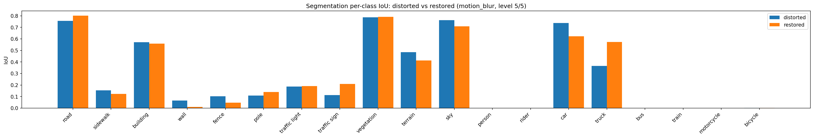
*Per-class segmentation IoU, distorted vs. restored, motion blur.*

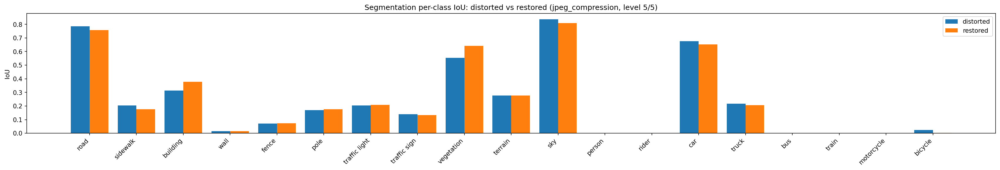
*Per-class segmentation IoU, distorted vs. restored, JPEG compression.*

**Summary — clean vs. distorted vs. restored, per task, strongest severity:**

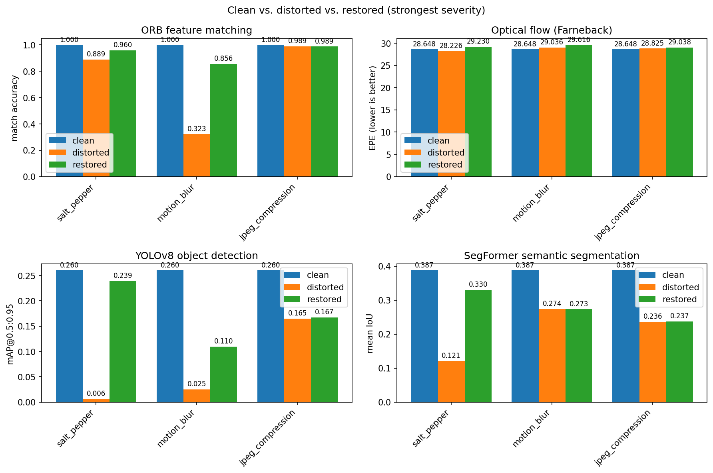
*One grouped bar chart per task: clean / distorted / restored, grouped by distortion type, at each distortion's strongest tested level.*

**Notebook 04's own detailed impact table** (cell 23, reproduced with its stated "level 0 → 4" ranges):

| Distortion | Task | Distorted impact | Restored impact | Takeaway |
|---|---|---|---|---|
| Salt & pepper | Detection mAP | Collapse (0.21 → 0.01) | Complete recovery (≈0.25 flat) | Denoising fully restores detector bounding boxes |
| Salt & pepper | Segmentation IoU | Severe drop (0.37 → 0.12) | Complete recovery (≈0.33–0.34) | Removes pixel noise, stabilizes class masks |
| Salt & pepper | Feature matching | Moderate drop (0.98 → 0.89) | Baseline recovery (≈0.96–0.97) | Denoising eliminates false-positive keypoint spikes |
| Salt & pepper | Optical flow (EPE) | Artificially low (27.5 → 28.2) | Higher, "true" EPE (≈29.2 flat) | Metric anomaly — see §9.2's noise-artifact note |
| Motion blur | Detection mAP | Severe drop (0.25 → 0.02) | Strong recovery (0.28 → 0.11) | Deblurring brings back missing proposals |
| Motion blur | Segmentation IoU | Steady drop (0.39 → 0.27) | Slightly lower (0.40 → 0.27) | Deblurring ringing artifacts slightly harm boundaries |
| Motion blur | Feature matching | Catastrophic drop (0.98 → 0.32) | Massive recovery (0.94 → 0.86) | Re-establishes high-frequency gradients for corners |
| Motion blur | Optical flow (Fl-error) | Outliers spike (→0.70) | Suppressed (≤0.60) | Reconstructs valid frame-to-frame motion |
| JPEG | High-level tasks (mAP/IoU/ORB) | Moderate drop at q≤10 | Identical to distorted | No effect — de-blocking yields zero downstream gain |
| JPEG | Optical flow | Slight rise (28.6→28.8) | Slightly higher (≈29.0) | Slightly harmful — filter smoothing alters local gradients |

Notebook 04's own summary judgment: "Denoising salt & pepper noise delivers the largest performance gain across both detection and segmentation... Deblurring is highly beneficial for Object Detection... but offers marginal to negative value for Semantic Segmentation... Post-processing restoration for JPEG artifacts provides no practical gain for high-level computer vision models."

### 9.4 Distortion-aware fine-tuning (notebook 05)

Setup detailed in §7.4. Full sweep source: `results/05_finetuning_distorted/summary.csv` (15 rows, both fine-tuned variants at every distortion×level). The notebook's own final comparison table (its last markdown cell, "Conclusion:") reports each distortion at its own maximum tested severity:

| Distortion | Metric | clean | distorted | restored | fine-tuned (aware) | fine-tuned (clean-control) |
|---|---|---|---|---|---|---|
| Salt & Pepper | mAP | 0.260 | 0.006 | 0.240 | **0.285** | 0.008 |
| Salt & Pepper | mAP@0.5 | 0.419 | 0.010 | 0.379 | **0.466** | 0.015 |
| Salt & Pepper | mean IoU | 0.387 | 0.121 | 0.330 | **0.407** | 0.131 |
| Motion Blur | mAP | 0.260 | 0.025 | 0.109 | **0.332** | 0.023 |
| Motion Blur | mAP@0.5 | 0.419 | 0.045 | 0.180 | **0.511** | 0.044 |
| Motion Blur | mean IoU | 0.387 | 0.274 | 0.273 | **0.424** | 0.369 |
| JPEG Compression | mAP | 0.260 | 0.165 | 0.167 | **0.372** | 0.213 |
| JPEG Compression | mAP@0.5 | 0.419 | 0.243 | 0.257 | **0.607** | 0.327 |
| JPEG Compression | mean IoU | 0.387 | 0.236 | 0.237 | **0.476** | 0.341 |

(On the "clean" column's slightly different mAP@0.5 value here vs. §9.1's 0.4171, see the provenance caveat in §9.1.)

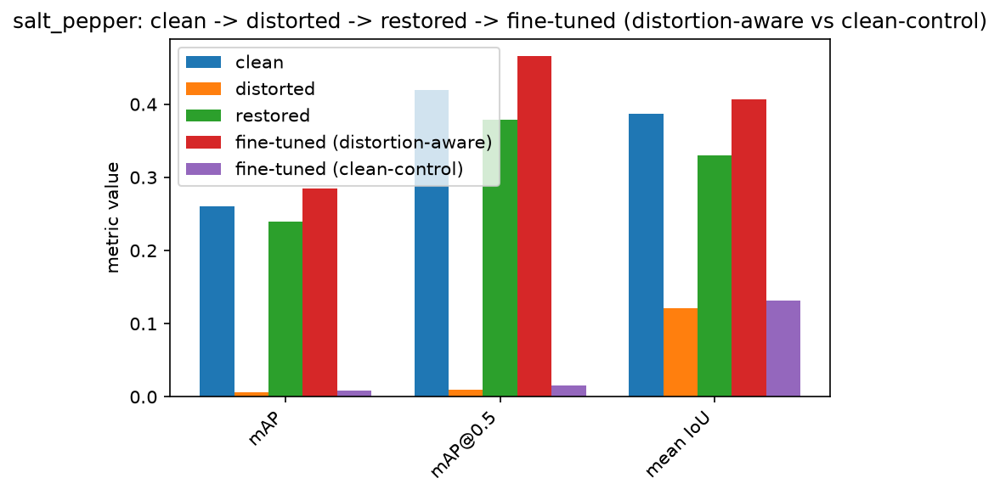
*Clean → distorted → restored → fine-tuned, salt & pepper noise, mAP / mAP@0.5 / mean IoU.*

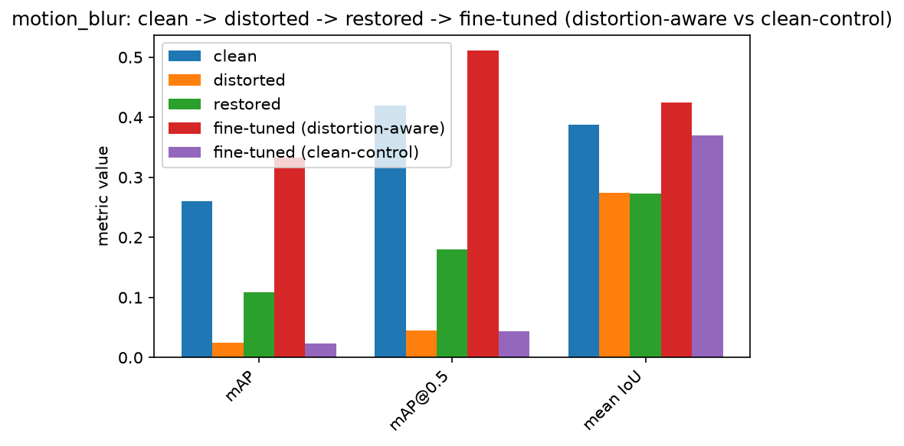
*Clean → distorted → restored → fine-tuned, motion blur, mAP / mAP@0.5 / mean IoU.*

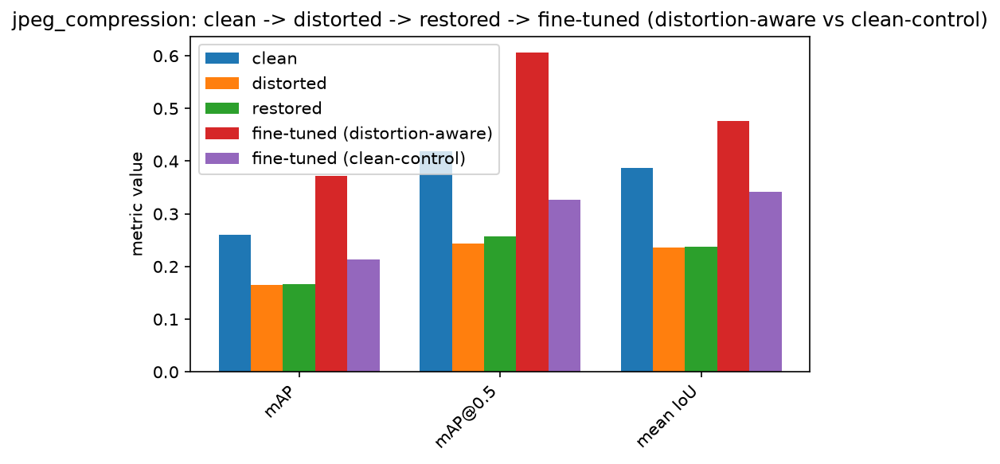
*Clean → distorted → restored → fine-tuned, JPEG compression, mAP / mAP@0.5 / mean IoU.*

**The notebook's own per-distortion takeaways** (its Conclusion cell, quoted/paraphrased):

- **Salt & Pepper**: restoration alone recovers most of the loss (mAP 0.006 → 0.240); fine-tuning adds a further +0.045 mAP on top.
- **Motion Blur**: restoration is the weakest of the three (mAP 0.025 → 0.109), and fine-tuning produces the single largest jump in the whole comparison (0.025 → 0.332, ~13×).
- **JPEG Compression**: restoration barely moves the needle (0.165 → 0.167); fine-tuning again dominates (0.165 → 0.372).

**Clean-control ablation**: the notebook states that distortion-aware fine-tuning "clears clean-control by a wide margin in every condition, confirming the improvement... is attributable to the distorted training data itself, not just additional training time." The clean-control numbers in the table above make the point directly — e.g. for motion blur, the clean-control fine-tune (mAP 0.023) does not even outperform doing nothing at all (0.025, distorted with no fine-tuning), i.e. extra training on clean-only data bought nothing against a distortion the model never saw.

**Severity trend**: the notebook states the gap between the two fine-tuned variants **widens** as distortion severity increases; the underlying per-level numbers are in `results/05_finetuning_distorted/summary.csv` rather than spelled out in the notebook's own prose (that sentence is truncated in the source cell). Reading the CSV directly: for salt & pepper, distortion-aware mAP declines only mildly from level 0 to level 4 (0.391 → 0.285), while clean-control collapses toward zero over the same range (0.284 → 0.008).

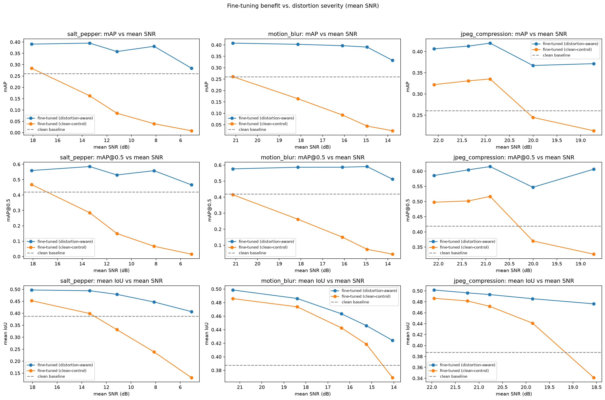
*mAP / mAP@0.5 / mean IoU vs. mean SNR, distortion-aware vs. clean-control, one panel per distortion, with clean-baseline reference.*

**Qualitative results**: baseline vs. distortion-aware vs. clean-control predictions on the same sample image at each distortion's maximum severity. The notebook's own qualitative observation (cell 33): YOLOv8's bounding-box regression is "far more fragile under noise than SegFormer's spatial self-attention" — YOLO collapses to zero detections under severe salt & pepper noise while SegFormer retains rough global layout even before fine-tuning; the distortion-aware model "consistently eliminates visual hallucination, corrects class confusion, and restores high-confidence detections across every distortion type at maximum severity."

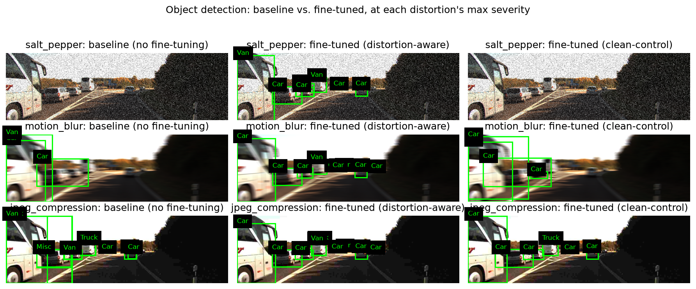
*Baseline vs. distortion-aware vs. clean-control detection, each distortion at its maximum severity.*

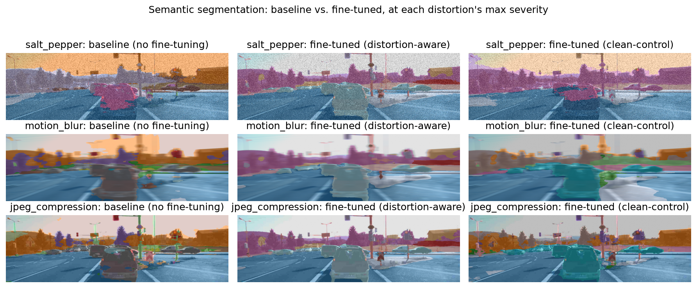
*Baseline vs. distortion-aware vs. clean-control segmentation, each distortion at its maximum severity.*

**Stated limitation** (verbatim from the notebook's own Conclusion cell): *"This notebook evaluates the fine-tuned checkpoints only against distorted test sets, never against the clean test set — so... there's no measured evidence here either way on whether distortion-aware fine-tuning preserved clean-image performance. That would need an additional clean-image eval pass, not yet run."*

**Notebook's own overall conclusion**: *"Across all 3 distortions and all 3 metrics, distortion-aware fine-tuning on a blended (all distortions × all severities) training mix is the most effective and consistent intervention in this pipeline — it beats both classical restoration and a same-budget clean-only fine-tune everywhere, and that advantage grows precisely as distortion severity increases."*

## 10. Cross-Cutting Comparisons

Pulling the four-stage comparison together, per distortion (object detection mAP, from §9.4's table, the most complete cross-stage table available):

| Distortion | Clean | Distorted | Restored | Fine-tuned (aware) | Verdict |
|---|---|---|---|---|---|
| Salt & pepper | 0.260 | 0.006 | 0.240 | 0.285 | Restoration alone nearly closes the gap; fine-tuning closes it fully and slightly exceeds clean |
| Motion blur | 0.260 | 0.025 | 0.109 | 0.332 | Restoration only partially recovers; fine-tuning is decisively the stronger intervention |
| JPEG compression | 0.260 | 0.165 | 0.167 | 0.372 | Restoration is essentially ineffective; fine-tuning is the only intervention that meaningfully helps |

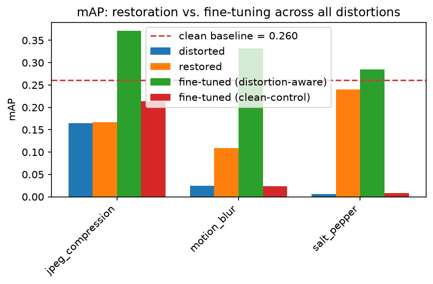
*Detection mAP, all 3 distortions, clean-control vs. distortion-aware fine-tuned.*

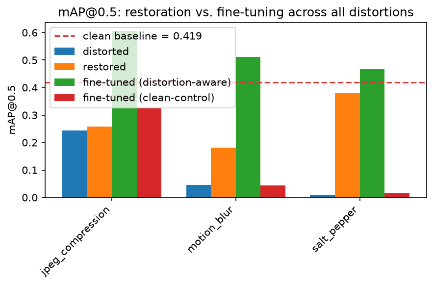
*Detection mAP@0.5, all 3 distortions, clean-control vs. distortion-aware fine-tuned.*

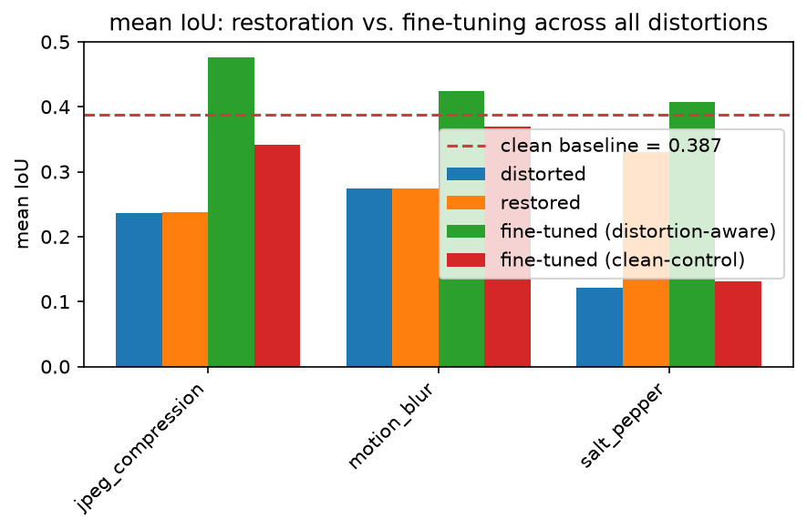
*Segmentation mean IoU, all 3 distortions, clean-control vs. distortion-aware fine-tuned.*

The two recovery strategies are **not interchangeable across distortions**: classical restoration's effectiveness tracks how well-matched its assumption is to the distortion (median filtering is close to ideal for i.i.d. impulse noise; frequency-domain deconvolution needs the exact known blur kernel and is only partially effective; bilateral filtering + interpolation for JPEG artifacts was flagged from the start, per §6, as the weakest-grounded pairing in the project, and its near-zero measured effect is consistent with that). Distortion-aware fine-tuning, in contrast, is effective across all three distortions and is the only approach that both restores *and*, in this measurement, exceeds clean-baseline performance at maximum severity for two of the three distortions (salt & pepper, motion blur, JPEG — see §9.4's table) — though see §15 for why this specific "exceeds clean" framing should be read cautiously.

Per-task vulnerability patterns also differ systematically (§9.2's table): motion blur is the dominant threat to both classical tasks (ORB, Farneback) because they depend on sharp local gradients/textures; salt & pepper noise and JPEG compression are the dominant threats to the two DL tasks, respectively, for detection and (per-dB) for segmentation.

## 11. Feature Matching and Optical Flow — Consolidated

These are the project's two low-level, classical (non-learned) tasks. Their full clean/distorted/restored numbers are already reported in §9.1–9.3 (match accuracy and EPE/Fl-error columns) and are not duplicated here. Key facts, gathered in one place:

- **Feature matching (ORB)**: clean-vs-clean self-match accuracy is a trivial 1.000 ceiling (§9.1). Under distortion, motion blur is catastrophic (0.983 → 0.323 at max severity, §9.2), salt & pepper is mild (0.987 → 0.889), and JPEG is nearly harmless (0.998 → 0.989). Restoration recovers most of the motion-blur loss (0.323 → 0.856, §9.3) and nearly all of the salt & pepper loss (0.889 → 0.960).
- **Optical flow (Farneback)**: EPE/Fl-error on clean images are already large (28.6 px / 0.558, §9.1) — a property of the classical method itself, not of any distortion. Motion blur increases both error metrics; the salt & pepper case shows a known metric artifact (§9.2) where impulse noise can *appear* to lower EPE because stationary noise spikes read as near-zero motion; restoration removes this artifact and restores the metric to its "true," slightly-higher level (§9.3).

Neither task is fine-tuned in notebook 05 — ORB and Farneback are non-learned/non-parametric methods, so "fine-tuning" is not defined for them; this follows the locked project scope (`CLAUDE.md`: "fine-tuning (notebook 05) only applies to the two DL tasks").

## 12. Stereo Depth / Disparity

**Not implemented — out of the locked project scope.** The project's authoritative task table (`CLAUDE.md`) defines exactly four tasks (feature matching, optical flow, object detection, semantic segmentation); no stereo depth/disparity task exists anywhere in this codebase, and no KITTI stereo archive is referenced in `config.py`'s `KITTI_URLS`. This section exists to state that explicitly rather than silently omit it, since it is a plausible KITTI benchmark that a reader might expect.

## 13. Observations and Analysis

**Distortion mechanism determines which visual property is destroyed, and that in turn determines which task suffers**: salt & pepper noise injects high-frequency, spatially-random spikes that destroy *local* gradient information (hurting YOLO's edge-dependent region proposals and ORB's uncorrupted-patch assumption breaks down less severely than blur does), while leaving enough spatially-global structure intact for a transformer-based segmentation model to partially cope. Motion blur removes fine spatial detail and sharp transitions, which is exactly what both classical tasks (ORB, Farneback) depend on — hence it is their shared worst case — while segmentation, relying on broader context, degrades more gracefully. JPEG compression's blocking/ringing artifacts are comparatively mild for classical, gradient/keypoint-based methods but compound with quantization loss at low quality for the DL tasks' finer boundary/edge cues.

**Restoration effectiveness is bounded by how well its underlying model matches the distortion.** Median filtering is a near-ideal, well-posed operation for i.i.d. impulse noise, and this shows in near-complete recovery across every task tested (§9.3). Wiener deconvolution requires an accurately known blur kernel; the project supplies the *exact* kernel used to create the distortion (§6), yet recovery is still only partial for detection/segmentation and strong-but-incomplete for ORB — consistent with deconvolution's own noise-amplification sensitivity even under ideal, known-kernel conditions. Bilateral filtering + interpolation for JPEG, the one distortion/restoration pairing without dedicated course grounding, measurably fails to help the high-level tasks at all (§9.3) — this is consistent with, not contradictory to, the pairing having been flagged as the weakest-grounded choice when the project's scope was locked.

**Fine-tuning generalizes where restoration cannot.** Because a fine-tuned model learns to recognize the corrupted feature statistics directly, rather than trying to invert them first, it is not limited by how well a hand-designed restoration operator matches the true corruption process — this explains why fine-tuning dominates specifically for JPEG (the distortion whose restoration pairing is weakest) and for motion blur at severe kernel sizes (where deconvolution's own limitations are most exposed), while for salt & pepper — where restoration is already close to ideal — fine-tuning's marginal contribution on top of restoration is comparatively small (+0.045 mAP, §9.4) rather than transformative.

**The clean-control ablation is the most important internal control in the project.** Without it, "fine-tuning on distorted data improves distorted-data performance" would be a nearly tautological result. The ablation isolates the *specific* value of distortion exposure from the general value of additional training budget, and the result (clean-control performing no better, or in one case slightly worse, than doing nothing at all against a distortion it never saw, §9.4) is direct evidence that models do not spontaneously generalize to a distortion family from clean-only continued training, even with matched compute.

## 14. Conclusions

1. All three distortions measurably degrade all four tasks, but with distinct failure signatures rather than one uniform "distortion hurts vision models" trend — motion blur is the dominant threat to gradient/texture-dependent classical methods, while salt & pepper noise and JPEG compression are the dominant threats to the two DL tasks respectively (§9.2, §13).
2. Classical, distortion-specific restoration is effective in proportion to how well its assumptions match the distortion: near-complete recovery for salt & pepper (median filter), partial recovery for motion blur (Wiener deconvolution with a known kernel), and essentially no measurable benefit for JPEG compression (bilateral filtering + interpolation) (§9.3).
3. Distortion-aware fine-tuning on a blended (all distortions × all severities) training mix is, in this project's measurements, the single most effective and consistent recovery intervention across all three distortions and all three detection/segmentation metrics tested — it outperforms classical restoration everywhere, and a same-compute-budget clean-only fine-tune everywhere, with the performance gap over the clean-control ablation widening as distortion severity increases (§9.4, §10).
4. The two recovery strategies are complementary rather than redundant in principle (restoration is cheap and needs no retraining; fine-tuning needs labeled distorted training data and compute but generalizes further) — though this project did not separately measure restoration + fine-tuning combined (see §16).

## 15. Limitations

- **No local checkpoints or raw KITTI data.** Trained model weights and the downloaded KITTI archives are not present in the git repository (both gitignored); they exist only on the project owner's Google Drive from Colab runs. This report is written entirely from committed execution outputs (CSVs, PNGs, notebook cell outputs), not from an independent local re-run or re-verification of the pipeline.
- **Fine-tuned models were never re-evaluated on clean data.** Explicitly stated by the project itself (§9.4): notebook 05 only evaluates the two fine-tuned checkpoints against distorted test sets. There is therefore no direct evidence, in this project's own results, of whether distortion-aware fine-tuning preserved or degraded clean-image performance — the apparent "exceeds clean baseline at max severity" result in §9.4/§10 should be read as an observation about performance *on that specific distorted test condition*, not as evidence the model became strictly better than the clean-trained baseline in general.
- **Provenance mismatch in the "clean" reference number.** As noted in §9.1, notebook 05's internal clean-baseline reference (loaded from a non-git-tracked, apparently re-run copy of the clean-baseline CSV) differs slightly from the git-tracked `results/02_clean_baseline/summary.csv` used elsewhere in this report (e.g. mAP@0.5 0.419 vs. 0.4171). Both are legitimate single-run evaluations on the same 500-image split; the discrepancy was not further investigated.
- **Single-seed, single-run results throughout.** All metrics in this report come from one execution of each notebook with `RANDOM_SEED=42`; no repeated-run variance, confidence intervals, or statistical-significance testing was performed anywhere in the project. Differences reported as improvements (e.g. fine-tuning's +0.045 mAP on top of restoration for salt & pepper) should be read as point estimates from a single run.
- **JPEG restoration's weak grounding was a known, accepted gap, not a discovered flaw.** The salt & pepper / motion-blur restoration methods are directly grounded in specific course lecture sections; the JPEG → bilateral filtering + interpolation pairing has no dedicated lecture and was approved as a scope gap when distortions were locked in (§6). Its measured ineffectiveness (§9.3, §13) is consistent with, and should not be read as contradicting, that known limitation.
- **No stereo depth/disparity task.** Confirmed not part of this project's scope (§12).
- **Small evaluation subsets.** KITTI Semantics (200 images total) and KITTI Flow 2015 (200 pairs total) are used in their entirety, so segmentation/optical-flow results are not further sub-sampled, but detection uses only a 500-image subset of the full KITTI object-detection benchmark, and the severe class imbalance (§3.3, Car ≈69% of instances, `Person_sitting` = 19 instances / absent from the evaluation split entirely) likely limits how reliable rare-class per-class metrics are.

## 16. Future Work

The following are natural extensions suggested by the project's own results and stated gaps — presented as suggestions consistent with the codebase's existing architecture, not as commitments or in-progress work:

- **Run the missing clean-image re-evaluation** of the two notebook-05 fine-tuned checkpoints (distortion-aware and clean-control), to directly measure whether distortion-aware fine-tuning traded away any clean-image performance — the one gap the project's own conclusion cell explicitly flags as unmeasured (§9.4, §15).
- **Evaluate restoration + fine-tuning combined** (i.e. run the distortion-aware fine-tuned model on *restored*, rather than raw distorted, test images) to see whether the two recovery strategies compound, particularly for motion blur where neither alone fully recovers clean-baseline performance.
- **Repeat-run / seed-variance study** for at least the headline comparisons (§9.4's final-comparison table), to attach uncertainty to the reported point estimates given the single-seed protocol (§15).
- **Investigate the salt-and-pepper optical-flow metric artifact** (§9.2, §9.3) more directly — e.g. by inspecting per-pixel flow-error maps — to confirm the "stationary noise reads as near-zero motion" explanation rather than relying on it as a plausible but unverified hypothesis.
- **Reconcile the two divergent "clean baseline" CSVs** (§9.1's provenance caveat) by re-running notebook 02 once more and re-syncing both the git-tracked `results/` copy and notebook 05's internal reference from the same run.

---

*Report compiled from the repository state after commits up to and including `096aa8f` ("Update section title in finetuning notebook"). Source artifacts: `results/{02_clean_baseline,03_distortions,04_restoration,05_finetuning_distorted}/summary.csv`; `figures/{01_dataset_visualization,02_clean_baseline,03_distortions,04_restoration,05_finetuning_distorted}/*.png`; `notebooks/{01..05}*.ipynb` cell outputs and markdown analysis; `src/ipproj/{config.py, distortions/*, restoration/*, tasks/*, metrics/*}`; `CLAUDE.md`; `README.md`.*
